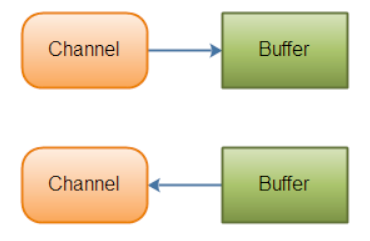

# 单点登录 & 鉴权

- 统一认证中心
  - 统一认证中心，主要是对APP用户、内部用户、APP等的认证服务
    - 用户的注册、登录验证、Token鉴权
    - 内部信息系统用户的管理和登录鉴权
    - APP的管理，包括APP的secret生成，APP信息的验证（如验证接口签名）等

- 单点登录
  - 单点登录，主要是对内部信息系统的用户登录鉴权
    - 用户的登录鉴权
    - 用户的权限管理
    - 用户的信息管理
  - CAS
    
  - 