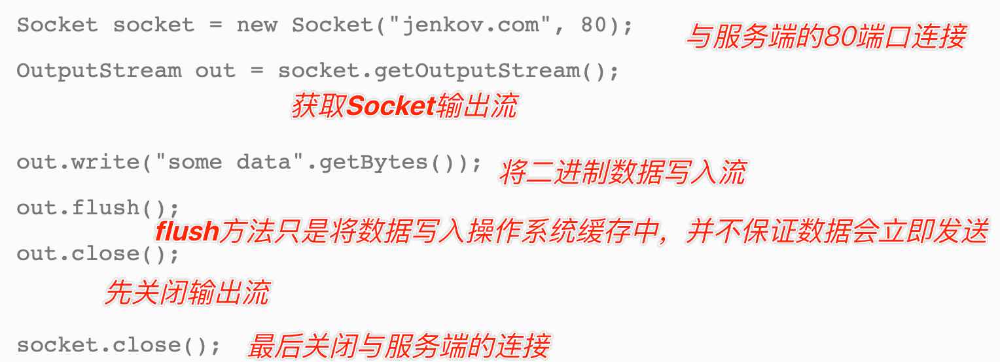

# Java高级编程
## 1、NIO
- NIO概念
  - Non-blocking IO（非阻塞IO）
  - 当线程从通道读取数据到缓冲区时，线程还是可以进行其他事情
  - 当数据被写入到缓冲区时，线程可以继续处理它
- NIO组成
  - Buffer（缓冲区）
    - 概念
      - position
          - 表示当前元素的位置
          - 最大：capacity - 1
      - limit
          - 读取指针的最大限度位置
      - capacity
          - 初始化容量大小
          - Buffer满了，需要将其清空（通过读数据或者清除数据）才能继续写数据往里写数据
      - mark
          - 对缓冲区进行标记，用于快速访问和回退
      - 上面四个基本参数的关系
          - 0 <= mark <= position <= limit <= capacity
    - 实现类
      - ByteBuffer
        - 字节缓冲区
      - DirectByteBuffer
        - 直接字节缓冲区
      - CharBuffer
      - DoubleBuffer
      - FloatBuffer
      - IntBuffer
      - LongBuffer
  - Channel（通道）
    - 概念
      - 通道支持异步读写
      - 数据经过Channel读取到Buffer，也可以从Buffer写数据到Channel【双向】
      
    - 实现类
      - FileChannel
        - 文件通道
      - DatagramChannel
        - UDP通道
      - SocketChannel
        - TCP通道
      - ServerSocketChannel
        - TCP服务端通道
  - Selector（选择器）
    - 概念
      - Selector允许单线程处理多个 Channel
        
    - 创建
      - Selector.open()
    - 注册
      - 将channel注册到selector
        - channel.configureBlocking(false);
          - **Channel必须处于非阻塞模式**
        - SelectionKey key = channel.register(selector, Selectionkey.OP_READ);
      - 监听类型
        - SelectionKey.OP_CONNECT
        - SelectionKey.OP_ACCEPT
        - SelectionKey.OP_READ
        - SelectionKey.OP_WRITE
## 2、序列化
- Java I/O
  - Java I/O包括InputStream、OutputStream、Reader、Writer
  - ObjectInputStream
    - 从输入流中读取Java对象
  - ObjectOutputStream
    - 将对象写入到输出流中
- 保证对象序列化的前提是类必须实现Serializable接口
- 序列化的作用
  - 1、对象的持久化
  - 2、对象的传输

```java
/**
 * 对象序列化
 */
public void objectToFile() throws IOException {

    Person person = new Person();
    person.setName("张三");
    person.setAge(25);

    String root = FileTest.class.getResource("/").getPath();

    FileOutputStream fos = new FileOutputStream(new File(root,"/person"));
    ObjectOutputStream oos = new ObjectOutputStream(fos);
    // 将Person对象写入到oos输出流中
    oos.writeObject(person);
}
/**
 * 对象反序列化
 *
 */
public void fileToObject() throws IOException, ClassNotFoundException {
    String root = FileTest.class.getResource("/").getPath();

    FileInputStream fis = new FileInputStream(new File(root,"/person"));
    ObjectInputStream ois = new ObjectInputStream(fis);
    // 从ois输入流中读取Person对象
    Person person = (Person) ois.readObject();
    System.out.println( person );
}

//对象序列化的前提是类必须实现Serializable接口
class Person implements Serializable{
    String name;
    int age;
    public Person() {
    }

    public String getName() {
        return name;
    }

    public void setName(String name) {
        this.name = name;
    }

    public int getAge() {
        return age;
    }

    public void setAge(int age) {
        this.age = age;
    }
}

```

## 3、RPC
- RPC
  - 远程调用（Remote Procedure Call），支持跨语言
- Java中的RPC
  - RMI
    - Remote Method Invocation
    - 远程方法调用
    - 只能调用Java语言编写的方法
    - 流程
      - 服务端将具体服务方法绑定到服务注册管理器
      - 客户端通过**lookup**方法发现服务注册管理器中的方法并调用远程方法
    
  - Hessian
    - 二进制RPC协议
    - 通过HTTP协议传输
    - 通过Java的反射机制，将本地的方法调用转化为二进制流，通过HTTP协议传输到远程，远程再将二进制流转化为方法调用
    - 流程
      - 通过显式地址调用
      - 利用HessianProxyFactory根据配置创建一个代理对象
    
  - Dubbo
    - 阿里巴巴开源的RPC框架
    - 流程
      - 服务端将远程调用服务注册到ZK
      - ZK监听客户端是否进行远程服务调用
      - 客户端调用远程服务
    
    

## 4、Concurrency

## 5、Disruptor

## 6、Socket
- Socket基础
  - 发送数据
    - 要通过Socket发送数据，需要获取Socket的输出流（写入数据）【输出流：写数据到文件中】
      
  - 读取数据
    - 从Socket中读取数据，需要获取Socket的输入流（读取数据）【输入流：从文件中读数据】
      
- 输出流
  - Java的基本输出流是java.io.OutputStream
  - 写入数据的基本方法
    - write(int):void
    - write(byte[]):void
    - write(byte[],int,int):void
    - flush():void
      - 1024字节的缓冲区（这个缓冲区会等待数据的到来，进而转换为死锁状态，在数据未满1024字节时，状态为阻塞）
      - flush()方法可以强迫缓冲的流发送数据，即使缓冲区还没有满
      - 应当在关闭流之前，立即刷新输出所有流
        - 否则会造成关闭流时留在缓冲区的数据丢失
    - close():void
      - Java 7引入了“带资源的try”构造（try with resources）
        - 不再需要在finally子句中关闭资源
        - Java会对try块参数列表中声明的所有AutoCloseable对象自动调用close()
      - try(OutputStream out = new OutputStream("date.txt")){ ... }catch(IOException ex){ ... }
- 输入流
  - Java的基本输入流是java.io.IutputStream
  - 读取数据的基本方法
    - read():int
      - 读取一个字节的数据
      - 返回值为读取的字节的值（0-255），如果已经读到流的末尾，返回-1
    - read(byte[]):int
      - 读取一定数量的字节，并将其存储在缓冲区数组中
      - 返回值为读取的字节数，如果已经读到流的末尾，返回-1
    - read(byte[],int,int):int
      - 读取一定数量的字节，并将其存储在缓冲区数组中
      - 返回值为读取的字节数，如果已经读到流的末尾，返回-1
    - close():void
      - Java 7引入了“带资源的try”构造（try with resources）
        - 不再需要在finally子句中关闭资源
        - Java会对try块参数列表中声明的所有AutoCloseable对象自动调用close()
      - try(InputStream in = new InputStream("date.txt")){ ... }catch(IOException ex){ ... }
- P2P
  - 使用Socket相关知识，模拟一个端到端的服务端与客户端通信方式（一个请求对应一个线程）

**Server**：服务端会一直等待客户端的消息，如果客户端没有进行消息的发送，服务端将一直进入阻塞状态
```java
/**
 * TODO 服务端
 * 服务端会一直等待客户端的消息，如果客户端没有进行消息的发送，服务端将一直进入阻塞状态
 */
public class Server {
    public static void main(String[] args) {
        try{
            System.out.println("===服务端启动===");
            // 1、定义一个ServerSocket对象进行服务端的端口注册
            ServerSocket ss = new ServerSocket(9999);
            // 2、监听客户端的Socket连接请求
            Socket socket = ss.accept();
            // 3、从socket管道中得到一个字节输入流对象
            InputStream is = socket.getInputStream();
            // 4、把字节输入流包装成一个缓存字符输入流
            BufferedReader br = new BufferedReader(new InputStreamReader(is));
            String msg;
            // 接收多条消息
            while ((msg = br.readLine()) != null){
                System.out.println("服务端收到：" + msg);
            }
            // 接收一条消息
//            if ((msg = br.readLine()) != null){
//                System.out.println("服务端收到：" + msg);
//            }
        }catch (Exception e){
            e.printStackTrace();
        }
    }
}
```
**Client**：客户端会一直等待服务端的消息，如果服务端没有进行消息的发送，客户端将一直进入阻塞状态
```java
/*** 客户端 */
public class Client {
    public static void main(String[] args) {
        try {//1.创建Socket对象请求服务端的连接
            Socket socket = new Socket("127.0.0.1", 9999);
            //2.从Socket对象中获取一个字节输出流
            OutputStream os = socket.getOutputStream();
            //3.把字节输出流包装成一个打印流
            PrintStream ps = new PrintStream(os);
            // 单词发送消息
//            ps.print("hello World! 服务端，你好");
//            ps.println("hello World! 服务端，你好");
//            ps.flush();
            // 发送多条消息
            Scanner sc = new Scanner(System.in);
            while (true) {
                System.out.print("请说：");
                String msg = sc.nextLine();
                ps.println(msg);
                ps.flush();
            }
        } catch (
                IOException e) {
            e.printStackTrace();
        }
    }
}
```
- 广播模式
  - 模拟广播模式通信，即一个请求对应多个线程。

**Server**：服务端每接收到一个客户端Socket请求对象之后都交给一个独立的线程来处理客户端的数据交互需求
```java
public class ServerThreadReader extends Thread{
    private Socket socket;

    public ServerThreadReader(Socket socket) {
        this.socket = socket;
    }

    @Override
    public void run() {
        try{
            // 1、从socket对象中得到一个字节输入流
            InputStream is = socket.getInputStream();
            // 2、使用缓存字符输入流包装字节输入流
            BufferedReader br = new BufferedReader(new InputStreamReader(is));
            String msg;
            // 3、循环打印客户端的消息
            while ((msg = br.readLine()) != null){
                System.out.println(msg);
            }
        }catch (Exception e){
            e.printStackTrace();
        }
    }
}
```
Server服务端具体实现
```java
public class Server {
    public static void main(String[] args) {
        try {
            // 1、注册端口
            ServerSocket ss = new ServerSocket(9999);
            // 2、循环接收客户端的Socket连接请求
            while (true) {
                Socket socket = ss.accept();
                // 3、创建一个独立的线程来处理与这个客户端的socket通信需求
                new ServerThreadReader(socket).start();
            }
        }catch (Exception e) {
            e.printStackTrace();
        }
    }
}
```
Client客户端具体实现
```java
public class Client {
    public static void main(String[] args) {
        try{
            // 1、请求与服务器的Socket对象连接
            Socket socket = new Socket("localhost", 9999);
            // 2、得到一个打印流
            PrintStream ps = new PrintStream(socket.getOutputStream());
            // 3、循环不断的发送消息给服务器端接收
            Scanner sc = new Scanner(System.in);
            while (true){
                System.out.print(" [root@localhost]:");
                String msg = sc.nextLine();
                ps.println(msg);
                ps.flush();
            }
        }catch (Exception e){

        }
    }
}
```
- 实现文件上传
  - 通过FileOutputStream来实现对文件的写入操作

**Server**
```java
public class ServerReadThread extends Thread{
    private Socket socket;

    public ServerReadThread(Socket socket) {
        this.socket = socket;
    }

    @Override
    public void run() {
        try{
            // 1、得到一个数据输入流来读取客户端发送过来的睡
            DataInputStream dis = new DataInputStream(socket.getInputStream());
            // 2、读取客户端发送过来的文件类型
            String suffix = dis.readUTF();
            System.out.println("服务端已经成功接收到了文件类型：" + suffix);
            // 3、定义一个字节输出管道，负责把客户端发来的文件数据写出去
            OutputStream os = new FileOutputStream("/Library/Soft/data/io/" + UUID.randomUUID().toString() + suffix);
            // 4、从数据输入流中读取文件数据，写出到字节输出流中去
            byte[] buffer = new byte[1024];
            int len;
            while ((len = dis.read(buffer)) > 0){
                os.write(buffer,0,len);
            }
            os.close();
            System.out.println("服务端接收文件保存成功");
        }catch (Exception e){

        }
    }
}
```
服务端的具体实现
```java
public class Server {
    public static void main(String[] args) {
        try{
            ServerSocket ss = new ServerSocket(8888);
            while (true){
                Socket socket = ss.accept();
                // 交给一个独立的线程来处理与这个客户端的文件通信需求
                new ServerReadThread(socket).start();
            }
        }catch (Exception e){
            e.printStackTrace();
        }
    }
}
```

**Client**
通过FileInputStream，对文件输操作保存到服务器
```java
public class Client {
    public static void main(String[] args) {
        try(
                InputStream is = new FileInputStream("/Library/Soft/data/io/1.jpg");
                ){
            // 1、请求与服务端的Socket连接
            Socket socket = new Socket("localhost", 8888);
            // 2、把字节输出流包装成一个数据输出流（DataOutputStream可以做分段数据发送）
            DataOutputStream dos = new DataOutputStream(socket.getOutputStream());
            // 3、先发送上传文件的后缀给服务器
            dos.writeUTF(".jpg");
            // 4、把文件数据发送给服务端进行接收
            byte[] buffer = new byte[1024];
            int len;
            while ((len = is.read(buffer)) > 0){
                dos.write(buffer,0,len);
            }
            dos.flush();
            socket.shutdownOutput();// 通知服务端，客户端发送完毕
        }catch (Exception e){
            e.printStackTrace();
        }
    }
}
```

## 7、Java8
- 官方文档
  - https://openjdk.org/projects/jdk8/milestones
- 