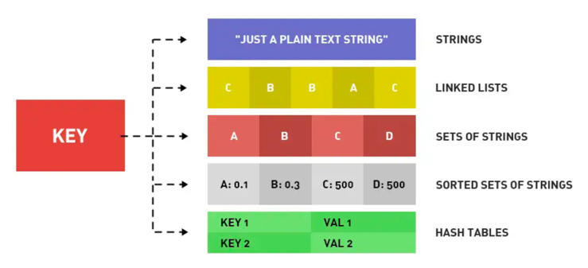

# 图解Redis
## 常见面试题
- Redis简介
  - Redis 是一种基于内存的数据库，对数据的读写操作都是在内存中完成，因此读写速度非常快，常用于缓存，消息队列、分布式锁等场景。
  - 数据类型
    - String(字符串)
    - Hash(哈希) 
    - List (列表)
    - Set(集合)
    - ZSet(有序集合)
    - Bitmaps（位图）
    - HyperLogLog（基数统计）
    - GEO（地理信息）
    - Stream（流）
- 为什么用 Redis 作为 MySQL 的缓存？
  - Redis具备高性能、高并发两种特性
    - 高性能
      - Redis直接操作内存中的数据，所以速度会很快
      - 用户获取数据走Redis，缓存命中直接从内存中返回，就不需要查询MySQL数据库
    - 高并发
      - Redis的QPS是MySQL的10倍
- 常见数据类型
  - String（字符串）
    - 结构存储的值
      - 可以是字符串、整数或浮点数
    - 读写能力
      - 对整个字符串或字符串一部分进行操作
      - 对整数或浮点数进行自增或自减
  - List（列表）
    - 结构存储的值
      - 一个链表，链表上的每个节点都存储着一个字符串
    - 读写能力
      - 对链表两端进行push和pop操作，读取单个或多个元素
      - 根据值查找或删除元素
  - Set（集合）
    - 结构存储的值
      - 包含字符串的无序集合
    - 读写能力
      - 字符串的集合，包含基础的方法有看是否存在添加、获取、删除
      - 计算交集、并集、差集
  - ZSet（有序集合）
    - 结构存储的值
    - 读写能力
  - Hash（哈希）
    - 结构存储的值
      - 包含键值对的无序散列表
    - 读写能力
      - 添加、获取、删除单个元素

- Redis数据类型的使用场景
  - String 
    - 共享Session
      - 将用户登录的Session数据存储在Redis，以实现共享Session 信息
    - 分布式锁
      - 即通过设置带有过期时间的键来实现分布式锁的获取和释放
      - 获取锁
        - jedis.set(lockKey, requestId, "NX", "EX", expireTime);
        - SET命令的参数含义：NX表示只在键不存在时才设置键的值，EX表示设置键的过期时间（单位：秒）
      - 释放锁
        - String luaScript = "if redis.call('get', KEYS[1]) == ARGV[1] then return redis.call('del', KEYS[1]) else return 0 end"; 
        - jedis.eval(luaScript, Collections.singletonList(lockKey), Collections.singletonList(requestId));
    - 
  - List
    - 消息队列
      - 生产者需要自行实现全局唯一 ID
      - 不能以消费组形式消费数据
  - Hash
    - 缓存对象
    - 购物车
  - Set
    - 点赞
    - 共同关注
    - 抽奖活动
  - ZSet
    - 排序场景，比如排行榜、电话和姓名排序
      